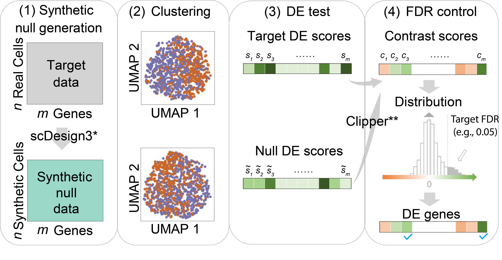

## ClusterDE

------------------------------------------------------------------------

The R package **ClusterDE** is a post-clustering DE method for controlling the false discovery rate (FDR) of identified between cell-type DE genes regardless of clustering quality. The core idea of ClusterDE is to generate real-data-based synthetic null data with only one cell type, as contrast to the real data, for evaluating the whole procedure of clustering followed by a DE test. <span style="color:blue"> **Detailed tutorials that illustrate various functionalities of ClusterDE are available at this [website](https://songdongyuan1994.github.io/ClusterDE/index.html)**</span>. The following illustration figure summarizes the usage of ClusterDE:



Instead of a new pipeline, ClusterDE actually works as an add-on to popular pipelines such as Seurat. To find out more details about **ClusterDE**, you can check out our manuscript on [bioRxiv](https://www.biorxiv.org/content/10.1101/2023.07.21.550107v1).

**The motivation and application of ClusterDE**: 
In Seurat function `findMarkers`, the authors pointed out: *"p-values should be interpreted cautiously, as the genes used for clustering are the same genes tested for differential expression."* This is the "double-dipping" issue. If your clustering results are inaccurate and since the clustering has used your expression data already, the discovered DE genes may not represent the discrete cell type separation, but other variation in your data (e.g., cell cycle, total UMI, or other variation you are not clear. These are still biological variation but do not define discrete status).

ClusterDE aims at correcting the double-dipping issue for comparing two dubious clusters, which you are not sure if they are two discrete cell types or just an artifact of your clustering algorithm based on conventional DE analysis. ClusterDE controls the false discoveries in DE and prioritizes the true cell type markers.

Note: current version is focusing on one vs one comparison.

## Installation<a name="installation-"></a>

To install the development version from GitHub, please run:

``` r
if (!require("devtools", quietly = TRUE))
    install.packages("devtools")
devtools::install_github("SONGDONGYUAN1994/scDesign3")
devtools::install_github("SONGDONGYUAN1994/ClusterDE")
```

Please note that ClusterDE is actually a wrapper of **scDesign3**. Therefore, you can also directly use scDesign3 to "design" your own synthetic null data. To better understand scDesign3, you can check out our manuscript on Nature Biotechnology:

[Song, D., Wang, Q., Yan, G. et al. scDesign3 generates realistic in silico data for multimodal single-cell and spatial omics. <em>Nat Biotechnol</em> (2023).](https://www.nature.com/articles/s41587-023-01772-1)

## Quick Start<a name="quick-start"></a>

The following code is a quick example of how to generate the synthetic null data. The input data should be a gene by cell matrix containing the two clusters you want to compare. If your input matrix is count data (especially UMI counts), `nb` (Negative Binomial) is usually the appropriate choice. The synthetic null data generation is relatively time-consuming; you may use the fast version (`fastVersion = TRUE`).

``` r
data(exampleCounts)
nullData <- constructNull(mat = exampleCounts,
                          family = "nb",
                          nCores = 1,
                          parallelization = "pbmcmapply",
                          fastVersion = FALSE,
                          corrCut = 0.2,
                          BPPARAM = NULL)
```

The parameters of `constructNull()` are:

- `mat`: The input gene by cell matrix. It can be a sparse matrix.
- `family`: A string of the distribution you want to use when fitting the model. Must be one of 'poisson', 'nb', 'zip', 'zinb' or 'gaussian'.
- `nCores`: An integer. The number of cores to use. Increasing the cores will greatly speed up the computaion.
- `parallelization`: A string indicating the specific parallelization function to use. Must be one of 'mcmapply', 'bpmapply', or 'pbmcmapply', which corresponds to the parallelization function in the package 'parallel', 'BiocParallel', and 'pbmcapply' respectively. The default value is 'pbmcmapply'.
- `fastVersion`: A logic value. If TRUE, the fast approximation is used.
- `corrCut`: A numeric value. The cutoff for non-zero proportions in genes used in modelling correlation. The reason is that lowly expressed genes are hard to calculate correlation.
- `BPPARAM`: A MulticoreParam object or NULL. When the parameter parallelization = 'mcmapply' or 'pbmcmapply', this parameter must be NULL. When the parameter parallelization = 'bpmapply', this parameter must be one of the MulticoreParam object offered by the package 'BiocParallel'. The default value is NULL.

The output of `constructNull()` is the new gene by cell matrix in the same format as your input.

The following figure briefly describes how ClusterDE generates the synthetic null data:


After obtaining the synthetic null data, you should *perform the same clustering procedure as you have done on your real data* to get the DE p-values (`nullPvalues`). Finally, we compare the p-values from the null and p-values from the target data (real data) by `callDE()`. For illustration, here we use the Uniform random numbers as the p-values.

```{r}
set.seed(123)
targetPvalues <- runif(10000)
nullPvalues <- runif(10000)
names(targetPvalues) <- names(nullPvalues) <- paste0("Gene", 1:10000)
res <- callDE(targetScores = targetPvalues,
              nullScores = nullPvalues,
              nlogTrans = TRUE,
              FDR = 0.05,
              correct = FALSE)
```

The parameters of `callDE` are:

- `targetScores`: A named numeric vector of the DE scores from the target data, e.g., the p-values between two clusters from the real data.
- `nullScores`: A named numeric vector of the DE scores from the synthetic null data, e.g., the p-values between two clusters from the null data.
- `nlogTrans`: A logical value. If the input scores are p-values, take the `-log10` transformation since Clipper require larger scores represent more significant DE. Default is TRUE.
- `FDR`: A numeric value of the target False Discovery Rate (FDR). Default is 0.05.
- `correct`: A logical value. If TRUE, perform the correction to make the distribution of contrast scores approximately symmetric. Default is FALSE.

The output of `callDE` is a list of target FDR, DE genes, and the detailed summary table.

## Tutorials<a name="tutorials"></a>

For all detailed tutorials, please check the [website](https://songdongyuan1994.github.io/ClusterDE/index.html). The tutorials will demonstrate the applications of **ClusterDE** in two cases: a cell line dataset (no cell type exists) and a PBMC dataset.

-   [Perform ClusterDE on a cell line dataset](https://songdongyuan1994.github.io/ClusterDE/articles/ClusterDE-cellline.html)
-   [Perform ClusterDE on a PBMC dataset](https://songdongyuan1994.github.io/ClusterDE/articles/ClusterDE-PBMC.html)


## Contact<a name="contact"></a>

Any questions or suggestions on `ClusterDE` are welcomed! Please report it on [issues](https://github.com/SONGDONGYUAN1994/ClusterDE/issues), or contact Dongyuan Song ([dongyuansong\@ucla.edu](mailto:dongyuansong@ucla.edu){.email}).

## Related Papers<a name="related-manuscripts"></a>

-   **scDesign3**: [Song, D., Wang, Q., Yan, G. et al. scDesign3 generates realistic in silico data for multimodal single-cell and spatial omics. <em>Nat Biotechnol</em> (2023).](https://www.nature.com/articles/s41587-023-01772-1)
-   **Clipper**: [Ge, X., Chen, Y.E., Song, D. et al. Clipper: p-value-free FDR control on high-throughput data from two conditions. <em>Genome Biology</em> 22, 288 (2021).](https://genomebiology.biomedcentral.com/articles/10.1186/s13059-021-02506-9)

## Other methods for double dipping problem
- **TN test**: [Zhang, J.M., Kamath, G.M., David, N.T. Valid post-clustering differential analysis for single-cell rna-seq. <em>Cell Systems</em>, 2019](https://www.sciencedirect.com/science/article/pii/S2405471219302698)
- **count split**: [Neufeld, A., Gao, L.L., Popp, J., Battle, A., Witten, D. Inference after latent variable estimation for single-cell RNA sequencing data. <em>Biostatistics</em>, 2022](https://academic.oup.com/biostatistics/advance-article/doi/10.1093/biostatistics/kxac047/6893953?login=true)
