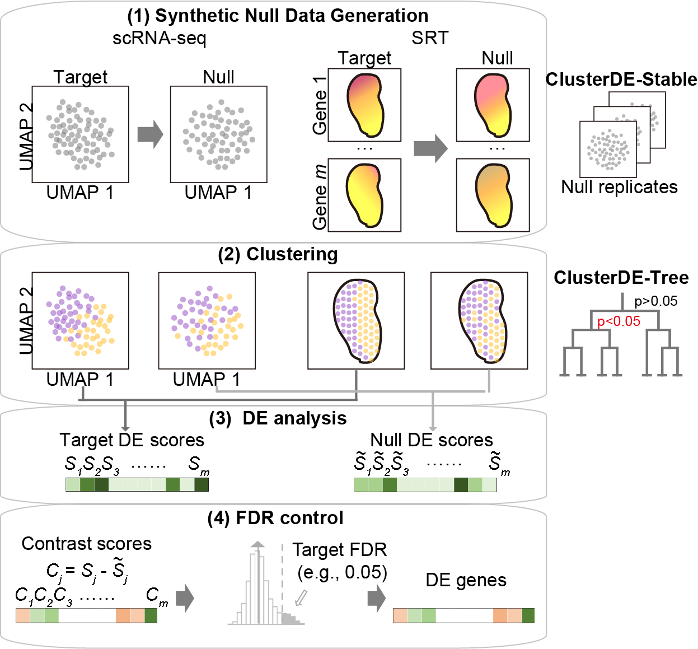
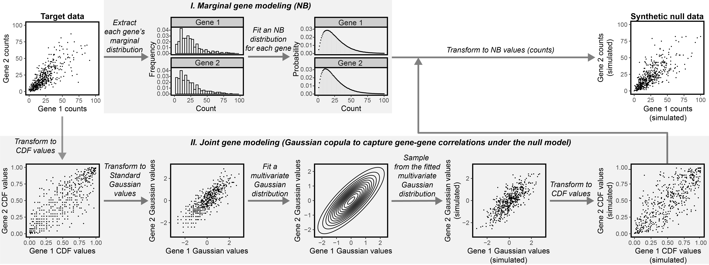

# ClusterDE

------------------------------------------------------------------------

The R package **ClusterDE** is a post-clustering DE method for controlling the false discovery rate (FDR) of identified
between cell-type DE genes regardless of clustering quality.
The core idea of ClusterDE is to generate real-data-based synthetic null data with only one cell type, as contrast to
the real data, for evaluating the whole procedure of clustering followed by a DE test.
<span style="color:blue"> **Detailed tutorials that illustrate various functionalities of ClusterDE are available at
this [website](https://songdongyuan1994.github.io/ClusterDE/index.html)**</span>.
The following illustration figure summarizes the usage of ClusterDE:



**The motivation and application of ClusterDE**:
In Seurat function `findMarkers`, the authors pointed out: *"p-values should be interpreted cautiously, as the genes
used for clustering are the same genes tested for differential expression."*
This is the "double-dipping" issue.
If your clustering results are inaccurate and since the clustering has used your expression data already, the discovered
DE genes may not represent the discrete cell type separation, but other variation in your data (e.g., cell cycle, total
UMI, or other variation you are not clear.
These are still biological variation but do not define discrete status).

ClusterDE aims at correcting the double-dipping issue for comparing two dubious clusters, which you are not sure if they
are two discrete cell types or just an artifact of your clustering algorithm based on conventional DE analysis.
ClusterDE controls the false discoveries in DE and prioritizes the true cell type markers.

# Installation<a name="installation-"></a>

To install the development version from GitHub, please run:

```r
if (!require("devtools", quietly = TRUE))
  install.packages("devtools")
devtools::install_github("SONGDONGYUAN1994/ClusterDE")
```

# Tutorials<a name="tutorials"></a>

For all detailed tutorials, please check the [website](https://songdongyuan1994.github.io/ClusterDE/index.html).

- [Perform ClusterDE on a monocyte scRNA dataset](https://songdongyuan1994.github.io/ClusterDE/articles/ClusterDE-monocyte-scrna.html)
- [Perform ClusterDE on a pure cell line dataset](https://songdongyuan1994.github.io/ClusterDE/articles/ClusterDE-pure-cellline.html)
- [Perform ClusterDE on a spatial dataset (one domain)](https://songdongyuan1994.github.io/ClusterDE/articles/ClusterDE-spatial-onedomain.html)
- [Perform ClusterDE on a spatial dataset (two domains)](https://songdongyuan1994.github.io/ClusterDE/articles/ClusterDE-spatial-twodomains.html)
- [Perform ClusterDE on a microbiome dataset](https://songdongyuan1994.github.io/ClusterDE/articles/ClusterDE-microbiome.html)

# API Reference

The example below shows how to manually generate null data from a gene-by-cell matrix containing the two clusters of interest.
For typical UMI count data, we recommend using the Negative Binomial model (`nb`).

```r
data(exampleCounts, package = "ClusterDE")
obj <- Seurat::CreateSeuratObject(counts = exampleCounts)
null_data <- ClusterDE::constructNull(
  obj,
  approximation = NULL,
  corr_cut = 0.1,
  data_type = "scRNA",
  family = "nb",
  formula = "1",
  if_sparse = F,
  n_cores = 1,
  n_pcs = 200,
  n_rep = 1,
  other_covariates = NULL,
  seed = 123
)
```

See [API Reference](https://songdongyuan1994.github.io/ClusterDE/reference/constructNull.html) for parameter settings of `constructNull()`.

The output of `constructNull()` is the new gene by cell matrix.

The following figure briefly describes how ClusterDE generates the synthetic null data:



After obtaining the synthetic null data, perform standard preprocessing and clustering pipeline to get DE p-values.

Finally, we compare the p-values from the null and p-values from the target data (real data) by `callDE()`.
See [API Reference](https://songdongyuan1994.github.io/ClusterDE/reference/callDE.html) for parameter settings of `callDE()`.

The output of `callDE()` is a list of DE genes, ordered by record from most significant to less significant.

# Contact<a name="contact"></a>

Any questions or suggestions on `ClusterDE` are welcomed! Please report it
on [issues](https://github.com/SONGDONGYUAN1994/ClusterDE/issues), or contact Dongyuan
Song ([dongyuansong\@ucla.edu](mailto:dongyuansong@ucla.edu){.email}).

# Other methods for double dipping problem

- **TN test**:
  [Zhang, J.M., Kamath, G.M., David, N.T. Valid post-clustering differential analysis for single-cell rna-seq. <em>Cell Systems</em>, 2019](https://www.sciencedirect.com/science/article/pii/S2405471219302698)
- **count split**:
  [Neufeld, A., Gao, L.L., Popp, J., Battle, A., Witten, D. Inference after latent variable estimation for single-cell RNA sequencing data. <em>Biostatistics</em>, 2022](https://academic.oup.com/biostatistics/advance-article/doi/10.1093/biostatistics/kxac047/6893953?login=true)
